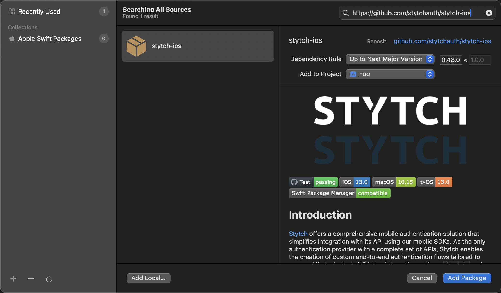

<div align=center>


  


</div>

## Introduction
[Stytch](https://stytch.com) offers a comprehensive mobile authentication solution that simplifies integration with its API using our mobile SDKs. As the only authentication provider with a complete set of APIs, Stytch enables the creation of custom end-to-end authentication flows tailored to your mobile tech stack. With two integration options, `Stytch` and `StytchUI`, Stytch's SDKs allow you to craft an authentication experience that flexibility integrates into your app. `Stytch` offers a fully customizable headless API integration to suit your specific needs, while `StytchUI` provides a configurable view to expedite the integration process.

Note: Currently StytchUI only supports our consumer client, B2B UI coming soon! 

## Getting Started and SDK Installation

If you are completely new to Stytch, prior to using the SDK you will first need to visit [Stytch's homepage](https://stytch.com), sign up, and create a new project in the [dashboard](https://stytch.com/dashboard/home). You'll then need to adjust your [SDK configuration](https://stytch.com/dashboard/sdk-configuration) — adding your app's bundle id to `Authorized applications` and enabling any `Auth methods` you wish to use.

Stytch uses the [Swift Package Manager](https://www.swift.org/package-manager/) for managing the distribution of our Swift code. It’s integrated with the Swift build system to automate the process of downloading, compiling, and linking dependencies. To add the Stytch SDK to your Xcode project complete the following steps.

1. Open Xcode
2. File > Add Package Dependencies
3. Enter https://github.com/stytchauth/stytch-ios
4. Choose Package Requirements. 
5. In your Build Settings, under `Other Linker Flags`, add `-ObjC`

We highly recommend that you use "Up To Next Major Version" and never point to `main` or any other branch directly. Knowing what version of the SDK you are using will make it easier for us to support you!



## Configuration

Before using any part of the Stytch SDK, you must call configure to set the public token as specified in your project dashboard.

``` swift
import StytchCore

StytchClient.configure(publicToken: "your-public-token")
```

## Stytch Core Usage

StytchCore exposes clients for Consumer and B2B, make sure to use the one that corresponds with your project configuration. For the sake of the following examples we will be using the consumer one: StytchClient.

The following basic example is for using OTP (One Time Passcode) to authenticate.

``` swift
import StytchCore

public class OTPAuthenticationManager {
    var methodId: String = ""

    // Send a OTP (one time passcode) via SMS
    func sendOTP() {
        Task {
            do {
                let parameters = StytchClient.OTP.Parameters(deliveryMethod: .sms(phoneNumber: "+12125551234"))
                let response = try await StytchClient.otps.send(parameters: parameters)
                // save the methodId for the subsequent authenticate call
                self.methodId = response.methodId
            } catch {
                print(error.errorInfo)
            }
        }
    }
    
    // Authenticate a user using the OTP sent via SMS
    func authenticateOTP(code: String) {
        Task {
            do {
                let parameters = StytchClient.OTP.AuthenticateParameters(code: code, methodId: methodId)
                let response = try await StytchClient.otps.authenticate(parameters: parameters)
                print(response.user)
            } catch {
                print(error.errorInfo)
            }
        }
    }
}
```

### Concurrency Options
Whereas `StytchCore` is written using `async/await`, we use [Sourcery](https://github.com/krzysztofzablocki/Sourcery) to generate versions of the API that can be used with `Combine` or called with a completion handler. If you look in the [generated](/Sources/StytchCore/Generated/) directory you will see the APIs with files ending in `+AsyncVariants` that hold the generated code. For instance, the async variants for the above APIs can be referenced here: [authenticate](/Sources/StytchCore/Generated/StytchClient.OTP.authenticate+AsyncVariants.generated.swift) & [send](/Sources/StytchCore/Generated/StytchClient.OTP.send+AsyncVariants.generated.swift).

## Further Stytch Usage
For further information and tutorials on some of our more common implementations, see the following:
* [Deeplinks](./tutorials/Deeplinks.md)
* [Email Magic Links](./tutorials/EmailMagicLinks.md)
* [OAuth](./tutorials/OAuth.md)
* [Passwords](./tutorials/Passwords.md)
* [Sessions](./tutorials/Sessions.md)
* [StytchUI](./tutorials/UI.md)

## Further Reading

Full reference documentation is available for [StytchCore](https://stytchauth.github.io/stytch-ios/main/StytchCore/documentation/stytchcore/) and [StytchUI](https://stytchauth.github.io/stytch-ios/main/StytchUI/documentation/stytchui/).

## Navigating the Project and Running the Sample Apps
[Instructions can be found here!](./tutorials/NavigatingTheProject.md)


## Get Help And Join The Community

Join the discussion, ask questions, and suggest new features in our ​[Slack community](https://stytch.com/docs/resources/support/overview)!

Check out the [Stytch Forum](https://forum.stytch.com/) or email us at [support@stytch.com](mailto:support@stytch.com).

## License

The Stytch iOS SDK is released under the MIT license. See [LICENSE](LICENSE) for details.
