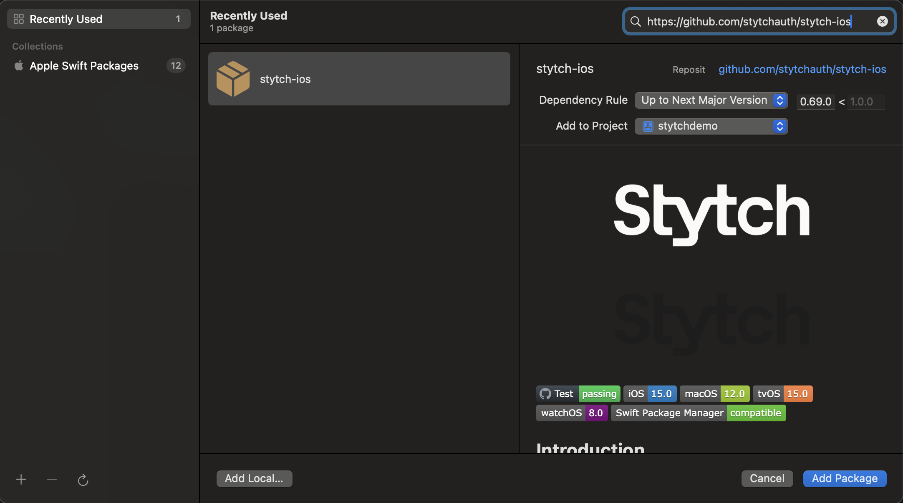

<div align=center>


   


</div>

## 📖 Introduction  

[Stytch](https://stytch.com) provides mobile SDKs that make it easy to integrate authentication into your app. As the only provider with a full API suite, Stytch lets you build custom end to end flows. You can choose between two options: `Stytch` for a fully customizable headless API integration, or `StytchUI` for prebuilt configurable views that speeds up implementation.


## 🚀 Getting Started With Stytch

- To begin, sign up and create a new project in the [Stytch dashboard](https://stytch.com/dashboard/home).  
- When creating a project, you will choose between **Consumer Authentication** and **B2B SaaS Authentication**. 
- For most iOS apps, you will likely use **Consumer Authentication**. Learn more in the [docs](https://stytch.com/docs/getting-started/b2b-vs-consumer-auth).  
- After your project is set up, configure the [SDK settings](https://stytch.com/dashboard/sdk-configuration) by adding your app's bundle ID under **Authorized applications** and enabling the **Auth methods** you want to support.


## 📦 SDK Installation

The Stytch iOS SDK is distributed through the [Swift Package Manager](https://www.swift.org/package-manager/). To add the Stytch SDK to your Xcode project, follow these steps.

1. Open Xcode
2. File > Add Package Dependencies
3. Enter https://github.com/stytchauth/stytch-ios in the top right
4. Choose Package Requirements and click "Add Package"
5. In your Build Settings, under `Other Linker Flags`, add `-ObjC`
6. `import StytchCore` or `import StytchUI` in your code

```
https://github.com/stytchauth/stytch-ios
```

We recommend that you use "Up To Next Major Version" and never point to `main` or any other branch directly. Knowing what version of the SDK you are using will make it easier for us to support you!




## 🔑 Integration Options

Stytch provides two ways to add authentication to your iOS app:

- **🛠️ Stytch**: A headless API integration that gives you complete control over the authentication experience.  
- **📱 StytchUI**: A reusable UI layer built on top of Stytch. It provides a configurable user flow that you can launch from SwiftUI or UIKit to handle authentication quickly without building every screen yourself.

*ℹ️ When using **StytchUI**, you can still use the full underlying client for both consumer and B2B integrations. This is useful for 👤 observing changes in the user or member, 🔐 managing the session, and 🧩 calling other headless methods relevant to your integration.*

| Option   | Consumer             | B2B                  |
|:--------:|:--------------------:|:--------------------:|
| 🛠️ Stytch   | `StytchClient`       | `StytchB2BClient`    |
| 📱 StytchUI | `StytchUIClient`     | `StytchB2BUIClient`  |


## ⚙️ Stytch Usage

Below are examples of authenticating with SMS OTP using both the Prebuilt UI and Headless methods. 🚀 We recommend starting with StytchUI to speed up integration.

### 📱 StytchUI Usage
``` swift
import Combine
import StytchCore
import StytchUI
import SwiftUI

struct ContentView: View {
    @StateObject var viewModel = ContentViewModel()

    var body: some View {
        NavigationView {
            VStack(spacing: 20) {
                Button("Log In With Stytch!") {
                    viewModel.shouldShowB2CUI = true
                }.font(.title).bold()
            }
            .authenticationSheet(configuration: viewModel.configuration, isPresented: $viewModel.shouldShowB2CUI)
        }
    }
}

class ContentViewModel: ObservableObject {
    @Published var shouldShowB2CUI: Bool = false

    private var cancellables = Set<AnyCancellable>()

    let configuration = StytchUIClient.Configuration.init(
        stytchClientConfiguration: .init(publicToken: "public-token-test-a9c3f1e2-b7d8-4g5h-9i2j-3k4l5m6n7o8p"),
        products: [.otp],
        otpOptions: .init(methods: [.sms])
    )
    
    init() {
        StytchUIClient.configure(configuration: configuration)
        
        StytchUIClient.dismissUI
            .receive(on: DispatchQueue.main)
            .sink { [weak self] in
                self?.shouldShowB2CUI = false
            }
            .store(in: &cancellables)
    }
}
```

*Here is a more detailed example of using [StytchUI](./READMEs/UI.md).* 


### 🛠️ StytchCore Usage

#### Headless Consumer Configuration

``` swift
import StytchCore

let stytchClientConfiguration = StytchClientConfiguration(
    publicToken: "public-token-test-a9c3f1e2-b7d8-4g5h-9i2j-3k4l5m6n7o8p", 
    defaultSessionDuration: 5
)

StytchClient.configure(configuration: stytchClientConfiguration)
```

#### Authenticate with SMS OTP (One Time Passcode). 

``` swift
import StytchCore

public class OTPAuthenticationManager {
    var methodId: String = ""

    // Send a OTP (one time passcode) via SMS
    func sendOTP() {
        Task {
            do {
                let parameters = StytchClient.OTP.Parameters(deliveryMethod: .sms(phoneNumber: "+12125551234"))
                let response = try await StytchClient.otps.send(parameters: parameters)
                // save the methodId for the subsequent authenticate call
                self.methodId = response.methodId
            } catch {
                print(error.errorInfo)
            }
        }
    }
    
    // Authenticate a user using the OTP sent via SMS
    func authenticateOTP(code: String) {
        Task {
            do {
                let parameters = StytchClient.OTP.AuthenticateParameters(code: code, methodId: methodId)
                let response = try await StytchClient.otps.authenticate(parameters: parameters)
                print(response.user)
            } catch {
                print(error.errorInfo)
            }
        }
    }
}
```

### 🔍 Finding Authentication Methods in the SDK

Authentication methods in the iOS SDK are namespaced by type. For example, `StytchClient` includes a type called `OTP` and a static instance called `otps`. The same pattern applies to other authentication methods, making it easy to discover and use the available functionality in a consistent way.

### ⚡️ Concurrency Options

`StytchCore` is written using `async/await` 🦅 but we use [Sourcery](https://github.com/krzysztofzablocki/Sourcery) 🧪 to generate versions of the API that can be used with `Combine` 🔗 or called with a completion handler.  

If you look in the [generated](/Sources/StytchCore/Generated/) directory 📂 you will see the APIs in the files ending in `+AsyncVariants` that hold the generated concurrency variants.


## 🔧 Additional Stytch Guides

Explore examples for some of the most common use cases in the SDK:

* [Deeplinks](./READMEs/Deeplinks.md)
* [Email Magic Links](./READMEs/EmailMagicLinks.md)
* [OAuth](./READMEs/OAuth.md)
* [Passwords](./READMEs/Passwords.md)
* [Sessions](./READMEs/Sessions.md)
* [Stytch UI (Consumer)](./READMEs/UI.md)
* [Stytch UI (B2B)](./READMEs/B2B-UI.md)
* [Localization in the Prebuilt UI](./READMEs/Localization.md)


## 🗂 Navigating the Project and 📱 Running the Sample Apps

In addition to installing the Swift package, it is highly recommended to clone this repo and explore the sample apps, which provide context and example code to help expedite your integration. [More details and Instructions can be found here!](./READMEs/NavigatingTheProject.md)


## 💬 Talk to a Stytch iOS Engineer

[Nidal](https://www.linkedin.com/in/nidal-fakhouri/) 👨‍💻 is our Stytch iOS lead 🍎 and is available to answer any questions about the Stytch iOS SDK 📱. He can also help you get started quickly 🚀.  

You can book time with him [here](https://calendly.com/nfakhouri-stytch/30min) 📅.


## 🤝 Get Help And Join The Community

Join the discussion, ask questions, and suggest new features in our ​[Slack community](https://stytch.com/docs/resources/support/overview)!

Check out the [Stytch Forum](https://forum.stytch.com/) or email us at [support@stytch.com](mailto:support@stytch.com).


## 📚 Further Reading  

Full reference documentation is available for [StytchCore](https://stytchauth.github.io/stytch-ios/main/StytchCore/documentation/stytchcore/) and [StytchUI](https://stytchauth.github.io/stytch-ios/main/StytchUI/documentation/stytchui/).


## 📄 License

The Stytch iOS SDK is released under the MIT license. See [LICENSE](LICENSE) for details.
