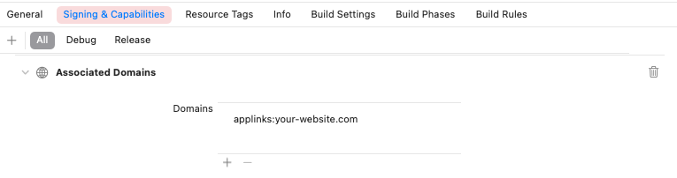

# Stytch Swift SDK

## Table of contents

* [Overview](#overview)
  * [Supported Products](#supported-products)
  * [Async Options](#async-options)
* [Requirements](#requirements)
* [Installation](#installation)
* [Getting Started](#getting-started)
  * [Configuration](#configuration)
  * [Authenticating](#authenticating)

## Overview

Stytch's SDKs make it simple to seamlessly onboard, authenticate, and engage users. Improve security and user experience with passwordless authentication. The Swift SDK provides the easiest way for you to use Stytch on Apple platforms.

#### Supported Products

- Email magic links
- One-time passcodes (SMS, WhatsApp, Email)
- Session management

Additional functionality coming in the near future!

#### Async Options

- `Async/Await`
- `Combine`
- ` Callbacks`

## Requirements

The Stytch Swift SDK is compatible with apps targeting the following Apple platforms:
- iOS 11.3+
- macOS 10.13+
- tvOS 11+

## Installation

### Swift Package Manager
1. Open Xcode
1. File > Add Packages
1. Enter https://github.com/stytchauth/stytch-swift
1. Choose Package Requirements (Up to next minor, up to next major, etc)

### Carthage
TBD

### CocoaPods
TBD
```
pod 'Stytch'
```

## Getting Started

### Configuration

To start using Stytch, you must configure it. You can configure the client in one of two fashions: 1) Automatically, by including a `StytchConfiguration.plist` file in your main app bundle ([Example](StytchDemo/Shared/StytchConfiguration.plist)), or 2) Programmatically at app launch (see `.task {}` below).
If you are using a redirect authentication product (Email Magic Links/OAuth) you will need to set up Associated Domains on [your website](https://developer.apple.com/documentation/Xcode/supporting-associated-domains) and in your app's entitlements ([Example](StytchDemo/macOS/macOS.entitlements)).



#### Manual configuration and deeplink handling
<!--<details>-->
<!--    <summary><b><u>SwiftUI</b></u></summary>-->
``` swift
@main
struct YourApp: App {
    private let stytchPublicToken = "your-public-token"
    private let hostUrl = URL(string: "https://your-backend.com")!

    @State private var session: Session?

    var body: some Scene {
        WindowGroup {
            ContentView(session: session) 
                .task {
                    StytchClient.configure(publicToken: stytchPublicToken, hostUrl: hostUrl)
                }
                // Handle web-browsing deeplinks
                .onContinueUserActivity(NSUserActivityTypeBrowsingWeb) { userActivity in
                    guard let url = userActivity.webpageURL else { return }
                    handle(url: url)
                }
                // Handle deeplinks
                .onOpenURL(perform: handle(url:))
        }
    }

    private func handle(url: URL) {
        Task {
            do {
                switch try await StytchClient.handle(url: url) {
                case let .handled((resp, _)):
                    self.session = resp.session
                case .notHandled:
                    // Handle via alternative means
                }
            } catch {
                handle(error: error)
            }
        }
    }
}
```
<!--</details>-->

### Authenticating

#### One-time passcodes
<details>
  <summary>One-time passcodes with Async/Await</summary>
``` swift
import StytchCore

final class SMSAuthenticationController {
    var methodId: String?
    var session: Session?
    var user: User?

    // phoneNumber must be a valid phone number in E.164 format (e.g. +1XXXXXXXXXX)
    func login(phoneNumber: String) async throws {
        let response = try await StytchClient.otps.loginOrCreate(
            parameters: .init(deliveryMethod: .sms(phoneNumber: phoneNumber))
        )
        // Store the methodId for the subsequent `authenticate(code:)` call
        methodId = response.methodId
    }

    func authenticate(code: String) async throws {
        guard let methodId = methodId else { throw YourCustomError }
        
        let response = try await StytchClient.otps.authenticate(
            parameters: .init(code: code, methodId: methodId, sessionDuration: 30)
        )
        session = response.session
        user = response.user
    }
}
```
</details>
