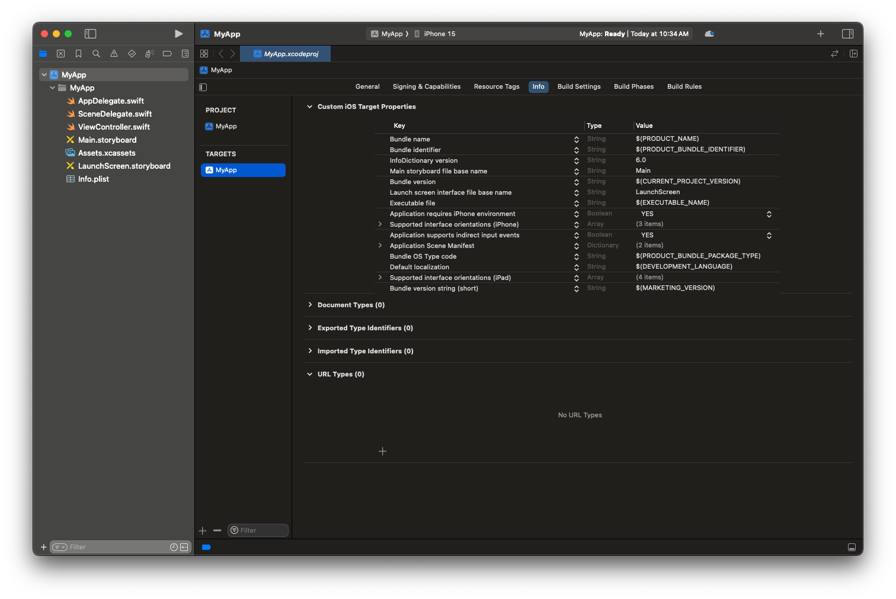
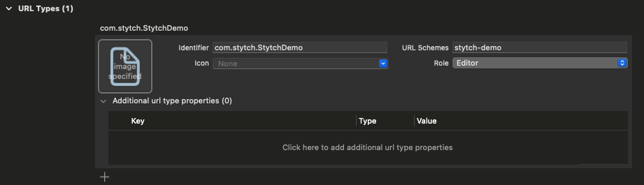
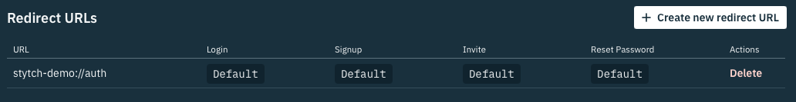
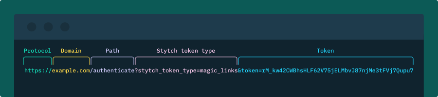

# Deeplinks
Depending on the authentication flows you offer in your app (for instance: Email Magic Links or Password Reset By Email), you may need to configure Stytch and your application to handle deeplinks.

# Step-By-Step
## Adding a new URL Scheme to your app.
In Xcode navigate to your target's "Info" tab and add a new entry under "URL Types"


Click the plus sign and choose a value to add to the "URL Schemes" field.


### Adding your links to Stytch
Adding your links as valid Redirect URLs in the [Stytch Dashboard](https://stytch.com/dashboard/redirect-urls)


### Further Reading on Deeplinks 
For a more advanced implementation using Universal Links please refer to the following reading.

[IOS Deep linking: URL Scheme vs Universal Links](https://medium.com/wolox/ios-deep-linking-url-scheme-vs-universal-links-50abd3802f97)

[Supporting Associated Domains](https://developer.apple.com/documentation/Xcode/supporting-associated-domains)

### Anatomy of a Stytch Redirect URL


## Handling the Deeplink

### In UIKit
In your `SceneDelegate` file add the following code
```swift
func scene(_: UIScene, openURLContexts URLContexts: Set<UIOpenURLContext>) {
    guard let url = URLContexts.first?.url else {
        return
    }

    handle(url: url)
}
```

### In SwiftUI
Add the following code to your root view.
```swift
.onOpenURL { url in
    handle(url: url)
}
```

### Handle the Deeplink
This handle method can be used for either UIKit or SwiftUI.
```swift
import StytchCore

func handle(url: URL) {
    Task {
        do {
            switch try await StytchClient.handle(url: url, sessionDurationMinutes: 5) {
            case let .handled(response):
                switch response {
                case let .auth(response):
                    print("handled .auth: \(response.session) - \(response.user)")
                case let .oauth(response):
                    print("handled .oauth: \(response.session) - \(response.user)")
                }
            case .notHandled:
                print("not handled")
            case let .manualHandlingRequired(tokenType, token, _):
                print("manualHandlingRequired: tokenType: \(tokenType) - token: \(token)")
            }
        } catch {
            print("handle url error: \(error)")
        }
    }
}
```

## Further Reading
For more information on the structure of Redirect URLs, consult our [guide](https://stytch.com/docs/guides/dashboard/redirect-urls).
