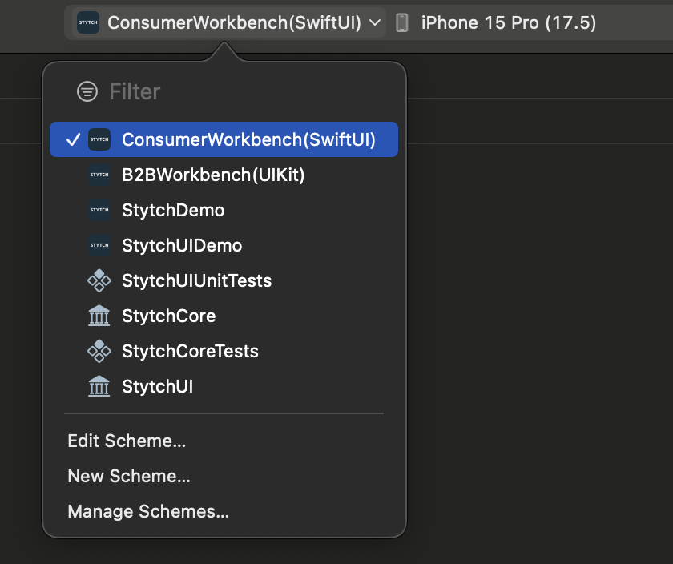

# Navigating the Project and Running the Sample Apps

## 1. Opening The Project
To open the project you must first open the project file located at: `stytch-ios/Stytch/Stytch.xcodeproj`

## 2. Navigating The Project
The repository has 2 top level directories within the project. 
* **DemoApps/**: All example code to help you get started and to help us test the SDK.
* **Stytch/**: The source code for the Stytch iOS SDK.

(Note. The directory structure in the file system does not exactly mirror the directory structure in the Xcode project)

## 3. Understanding the Sample Apps
The sample apps are broken down into 2 categories, workbench apps and demo apps.
* The workbench apps are testing apps, intended for internal development purposes. Almost all user flows are implemented in these apps, for reference and testing, but do not necessarily represent best practices or realistic usage.
* The demo apps are intended for demonstrating realistic use cases of the Stytch SDK, using both the Headless and Pre-Built UI implementations. Feel free to copy these projects and edit them to suit your needs

## 4. Configuring the Sample Apps
For each app you would like to run you must first ensure you have added your [public token](https://stytch.com/dashboard) to the code and have added the app’s bundle id to your project dashboard's [SDK configuration](https://stytch.com/dashboard/sdk-configuration), click "edit" for the "Authorized applications (Required)" section, add your bundle id under "Bundle & application IDs" and make sure to click "save".

* **StytchDemo**    
Bundle ID: `com.stytch.StytchDemo`  
[Configure the public token](https://github.com/stytchauth/stytch-ios/blob/f5a1fed4f54708fd7bc089340cccb3b2c3ab2d96/Stytch/DemoApps/StytchDemo/ContentView.swift#L21)    

* **StytchUIDemo**  
Bundle ID: `com.stytch.StytchUIDemo`  
[Configure the public token](TODO)
[Configure the URL Scheme](TODO)

* **ConsumerWorkbench**  
Bundle ID: `com.stytch.ConsumerWorkbench`  
[Configure the public token](https://github.com/stytchauth/stytch-ios/blob/f5a1fed4f54708fd7bc089340cccb3b2c3ab2d96/Stytch/DemoApps/ConsumerWorkbench/Shared/StytchDemoApp.swift#L6)  

* **B2BWorkbench**  
Bundle ID: `com.stytch.B2BWorkbench`  
[Configure the public token](https://github.com/stytchauth/stytch-ios/blob/0d0bb69237a69f266530f831eca3ef8c2b7a91c5/Stytch/DemoApps/B2BWorkbench/ViewControllers/RootViewController.swift#L43)  

## 5. Running the Sample Apps

You can select which target/app and which simulator you would like to run from the following menu. Then to run the target/app you chose you can press `⌘R`.

